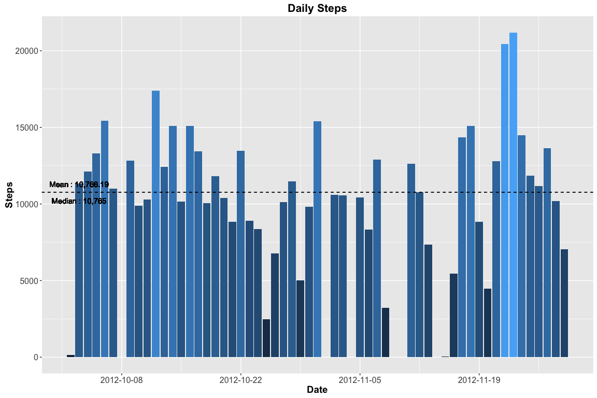
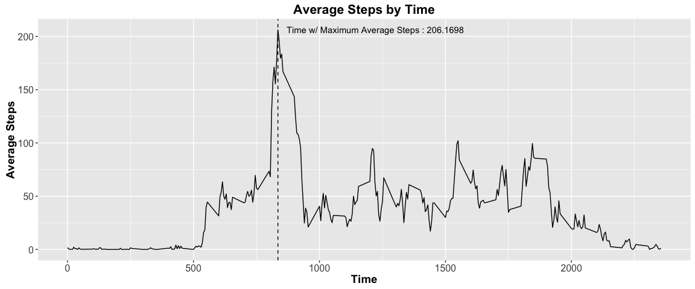
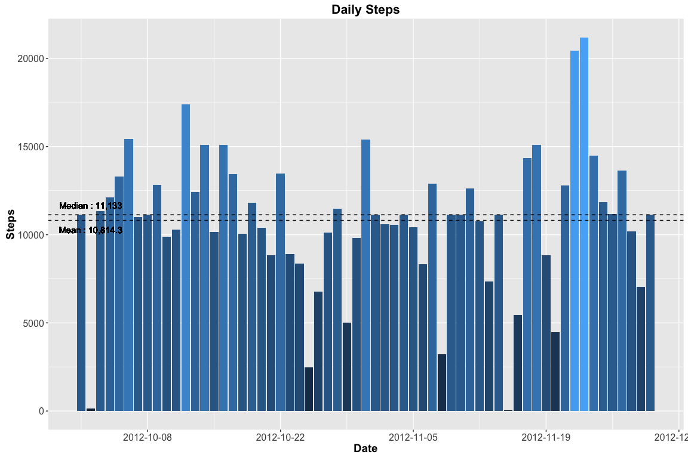
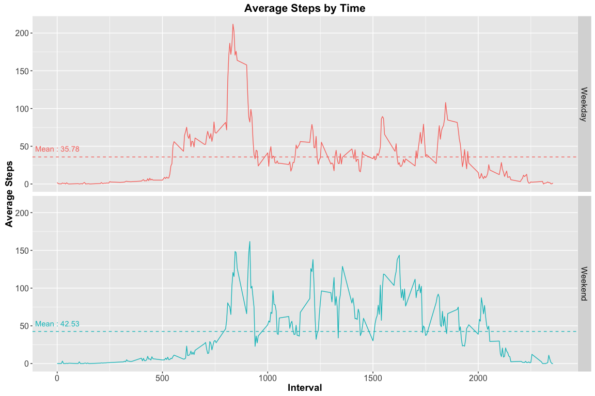

# Reproducible Research: Peer Assessment 1

******
# Overview

* This is the first project for the Reproducible Research class  

******

# Pre-Processing

## Markdown Configuration

* We configure the settings for our markdown file  


```r
knitr::opts_chunk$set(
  fig.path="figure/"
  ,fig.width=12
  )
```

## Working Directory  

* We set our working directory  


```r
setwd("/Users/bradychiu/Dropbox (Uber Technologies)/R/Coursera/05_Reproducible_Research/Assignment1/RepData_PeerAssessment1")
```

## Packages

* We load the necessary packages for this assignment  


```r
library(dplyr,warn.conflicts=F)
library(ggplot2,warn.conflicts=F)
library(lubridate,warn.conflicts=F)
library(knitr,warn.conflicts=F)
library(tidyr,warn.conflicts=F)
```

## Data Setup   

* We download our source data from the provided [link](https://d396qusza40orc.cloudfront.net/repdata%2Fdata%2Factivity.zip)  
* We then unzip and load our data  


```r
if(!file.exists("data")) dir.create("data/")

if(!file.exists("data/activity.csv")) {
  temp <- tempfile()
  download.file("http://d396qusza40orc.cloudfront.net/repdata%2Fdata%2Factivity.zip",temp)
  unzip(temp,exdir="data/")
  unlink(temp)
  rm(temp)
  }

activity_data<-read.csv("data/activity.csv")
```

******

# Analysis  

## What is mean total number of steps taken per day?  

* We calculate the daily total steps  


```r
daily_steps<-activity_data %>%
  dplyr::select(date,steps) %>% 
  na.omit() %>%
  mutate(date=ymd(date)) %>%
  group_by(date) %>%
  summarize(daily_steps=sum(steps))
daily_steps
```

```
## Source: local data frame [53 x 2]
## 
##          date daily_steps
##        (time)       (int)
## 1  2012-10-02         126
## 2  2012-10-03       11352
## 3  2012-10-04       12116
## 4  2012-10-05       13294
## 5  2012-10-06       15420
## 6  2012-10-07       11015
## 7  2012-10-09       12811
## 8  2012-10-10        9900
## 9  2012-10-11       10304
## 10 2012-10-12       17382
## ..        ...         ...
```

* We make a histogram of the daily total steps, and add horizontal lines for the mean and median   


```r
ggplot(
  daily_steps
  ,aes(x=date,y=daily_steps,fill=daily_steps))+
  geom_bar(stat="identity")+
  geom_hline(yintercept=mean(daily_steps$daily_steps),linetype="dashed")+
  geom_text(
    aes(
      label=paste(
        "Mean :"
        ,format(
          round(mean(daily_steps),2)
          ,big.mark=","
          ,trim=T
          )
        )
      ,x=min(date)+ddays(1)
      ,y=mean(daily_steps)
      ,vjust=-1
      )
    )+
  geom_hline(yintercept=median(daily_steps$daily_steps),linetype="dashed")+
  geom_text(
    aes(
      label=paste(
        "Median :"
        ,format(
          median(daily_steps)
          ,big.mark=","
          ,trim=T
          )
        )
      ,x=min(date)+ddays(1)
      ,y=median(daily_steps)
      ,vjust=2
      )
    )+
  ggtitle("Daily Steps")+
  scale_x_datetime(
    name="Date"
    ,date_breaks="2 week"
    ,date_labels="%Y-%m-%d"
    )+
  scale_y_continuous(
    name="Steps"
    )+
  theme(
    plot.title=element_text(face="bold",size=16)
    ,axis.title=element_text(face="bold",size=14)
    ,axis.text=element_text(size=12)
    ,legend.position="none"
    ,legend.text=element_text(size=10)
    ,strip.text=element_text(size=12)
    )
```



## What is the average daily activity pattern?  

* We calculate the average steps taken during each time period, and plot the results on a time series chart  
* We also determine which 5-minute interval contains the max number of steps  


```r
interval_steps<-activity_data %>%
  dplyr::select(interval,steps) %>%
  na.omit %>%
  group_by(interval) %>%
  summarize(avg_steps=mean(steps))
interval_steps
```

```
## Source: local data frame [288 x 2]
## 
##    interval avg_steps
##       (int)     (dbl)
## 1         0 1.7169811
## 2         5 0.3396226
## 3        10 0.1320755
## 4        15 0.1509434
## 5        20 0.0754717
## 6        25 2.0943396
## 7        30 0.5283019
## 8        35 0.8679245
## 9        40 0.0000000
## 10       45 1.4716981
## ..      ...       ...
```

```r
interval_max_steps<-interval_steps %>%
  filter(interval==interval[which(avg_steps==max(avg_steps))]) %>%
  mutate(avg_steps=round(avg_steps,2))

ggplot(
  interval_steps
  ,aes(x=interval,y=avg_steps)
  )+
  geom_line()+
  geom_vline(
    data=interval_max_steps
    ,linetype="dashed"
    ,aes(xintercept=interval_max_steps$interval)
    )+
  geom_text(
    data=interval_max_steps
    ,aes(
      label=paste(
        "Time w/ Maximum Average Steps :"
        ,format(
          avg_steps
          ,big.mark=","
          ,trim=T
          )
        )
      ,x=interval
      ,y=avg_steps
      ,hjust=-0.05
      )
    )+
  ggtitle("Average Steps by Time")+
  scale_x_continuous(name="Time")+
  scale_y_continuous(name="Average Steps")+
  theme(
    plot.title=element_text(face="bold",size=16)
    ,axis.title=element_text(face="bold",size=14)
    ,axis.text=element_text(size=12)
    ,legend.position="none"
    ,legend.text=element_text(size=10)
    ,strip.text=element_text(size=12)
    )
```



******

## Imputing missing values  

* We calculate the number of missing values in the original dataset  


```r
paste(
  "Total Number of Missing Values :"
  ,format(sum(is.na(activity_data$steps)),big.mark=",",trim=T)
  )
```

```
## [1] "Total Number of Missing Values : 2,304"
```

* We use the interval averages to build a loess model and estimate the progression of steps over the course of a day  
* We then use this model to predict the number of steps for each interval of the day  
    + Any negative predicted values are changed to 0  


```r
daily_steps.lo <- loess(steps~interval,activity_data)
daily_steps.predict <- predict(daily_steps.lo,data.frame(interval=seq(0,2355,5)),se=T)
predictions <- data.frame(interval=seq(0,2355,5),predicted_steps=ifelse(daily_steps.predict$fit<0,0,round(daily_steps.predict$fit,0)))
```

* We fill the missing values in our original data set with the values we imputed above  


```r
activity_data.imputed <- merge(activity_data,predictions,all.x=T) %>%
  mutate(
    date=ymd(date)
    ,steps=ifelse(is.na(steps),predicted_steps,steps),predicted_steps=NULL
    ) %>%
  dplyr::select(date,interval,steps) %>%
  arrange(date,interval)
```

* We compute the new daily total steps, and plot a histogram with this data, and add horizontal lines for the mean and median  


```r
daily_steps.imputed<-activity_data.imputed %>%
  dplyr::select(date,steps) %>% 
  mutate(date=ymd(date)) %>%
  group_by(date) %>%
  summarize(daily_steps=sum(steps))
daily_steps.imputed
```

```
## Source: local data frame [61 x 2]
## 
##          date daily_steps
##        (time)       (dbl)
## 1  2012-10-01       11133
## 2  2012-10-02         126
## 3  2012-10-03       11352
## 4  2012-10-04       12116
## 5  2012-10-05       13294
## 6  2012-10-06       15420
## 7  2012-10-07       11015
## 8  2012-10-08       11133
## 9  2012-10-09       12811
## 10 2012-10-10        9900
## ..        ...         ...
```

```r
ggplot(
  daily_steps.imputed
  ,aes(x=date,y=daily_steps,fill=daily_steps))+
  geom_bar(stat="identity")+
  geom_hline(yintercept=mean(daily_steps.imputed$daily_steps),linetype="dashed")+
  geom_text(
    aes(
      label=paste(
        "Mean :"
        ,format(
          round(mean(daily_steps),2)
          ,big.mark=","
          ,trim=T
          )
        )
      ,x=min(date)+ddays(1)
      ,y=mean(daily_steps)
      ,vjust=2
      )
    )+
  geom_hline(yintercept=median(daily_steps.imputed$daily_steps),linetype="dashed")+
  geom_text(
    aes(
      label=paste(
        "Median :"
        ,format(
          median(daily_steps)
          ,big.mark=","
          ,trim=T
          )
        )
      ,x=min(date)+ddays(1)
      ,y=median(daily_steps)
      ,vjust=-1
      )
    )+
  ggtitle("Daily Steps")+
  scale_x_datetime(
    name="Date"
    ,date_breaks="2 week"
    ,date_labels="%Y-%m-%d"
    )+
  scale_y_continuous(
    name="Steps"
    )+
  theme(
    plot.title=element_text(face="bold",size=16)
    ,axis.title=element_text(face="bold",size=14)
    ,axis.text=element_text(size=12)
    ,legend.position="none"
    ,legend.text=element_text(size=10)
    ,strip.text=element_text(size=12)
    )
```



******

## Are there differences in activity patterns between weekdays and weekends?  

* We first add day of week to our new data set  


```r
activity_data.imputed$date <- ymd(activity_data.imputed$date)
activity_data.imputed$day<-as.factor(ifelse(weekdays(activity_data.imputed$date,abbreviate=T) %in% c("Mon","Tue","Wed","Thu","Fri"),"Weekday","Weekend"))
head(activity_data.imputed,10)
```

```
##          date interval steps     day
## 1  2012-10-01        0     0 Weekday
## 2  2012-10-01        5     0 Weekday
## 3  2012-10-01       10     0 Weekday
## 4  2012-10-01       15     0 Weekday
## 5  2012-10-01       20     0 Weekday
## 6  2012-10-01       25     0 Weekday
## 7  2012-10-01       30     0 Weekday
## 8  2012-10-01       35     0 Weekday
## 9  2012-10-01       40     0 Weekday
## 10 2012-10-01       45     0 Weekday
```

* We create a summary of Weekdays Vs. Weekends  


```r
day_of_week_data<-activity_data.imputed %>%
  group_by(day,interval) %>%
  summarize(avg_steps=mean(steps))

day_of_week_means<-day_of_week_data %>%
  group_by(day) %>%
  summarize(mean=mean(avg_steps))
```

* We plot the results, and add horizontal lines for the means  


```r
ggplot(
  day_of_week_data
  ,aes(x=interval,y=avg_steps,color=day)
  )+
  geom_line()+
  facet_grid(day~.)+
  geom_hline(
    data=day_of_week_means
    ,linetype="dashed"
    ,aes(
      yintercept=mean
      ,color=day
      )
    )+
  geom_text(
    data=day_of_week_means
    ,aes(
      label=paste("Mean :",format(round(mean,2),big.mark=",",trim=T))
      ,x=1
      ,y=mean
      ,vjust=-1
      )
    )+
  ggtitle("Average Steps by Time")+
  scale_x_continuous(name="Interval")+
  scale_y_continuous(name="Average Steps")+
  theme(
    plot.title=element_text(face="bold",size=16)
    ,axis.title=element_text(face="bold",size=14)
    ,axis.text=element_text(size=12)
    ,legend.position="none"
    ,legend.text=element_text(size=10)
    ,strip.text=element_text(size=12)
    )
```


