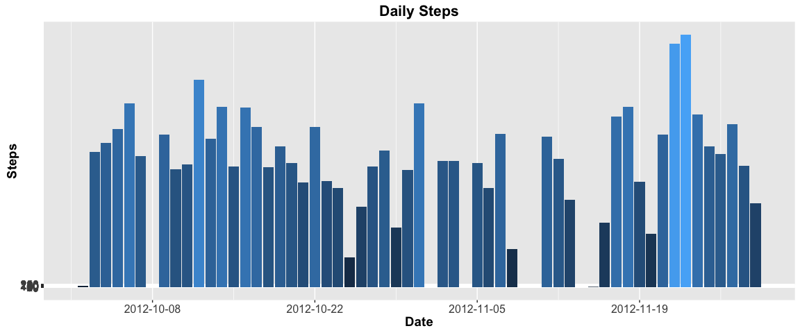
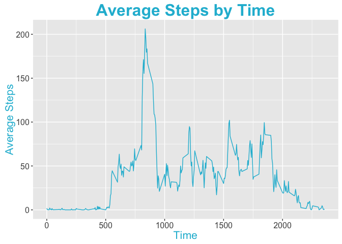
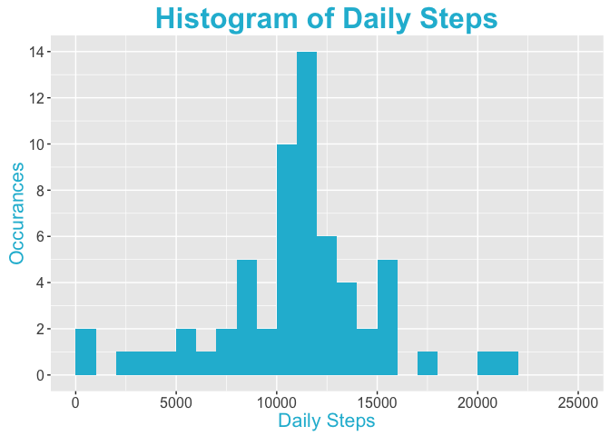
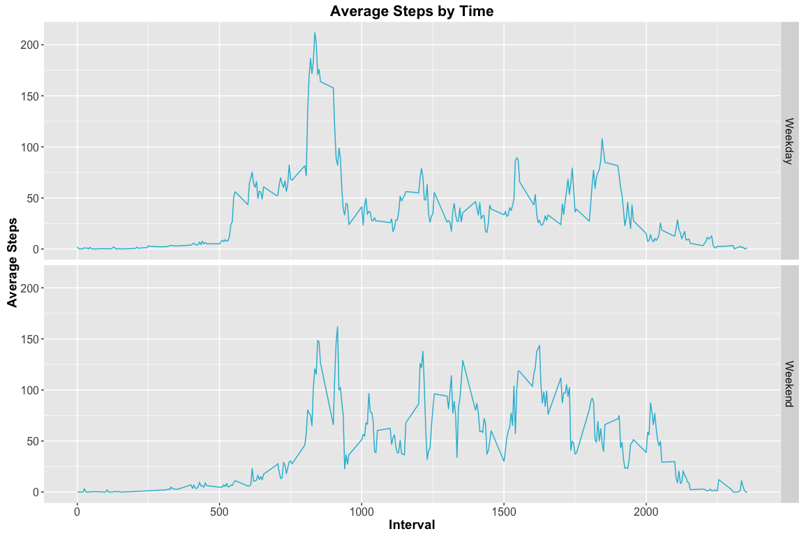

# Reproducible Research: Peer Assessment 1

******
##Overview

This is the first project for the reproducible research class.

******
##Packages

We'll load the necessary packages for this assignment.


```r
library(dplyr)
```

```
## 
## Attaching package: 'dplyr'
```

```
## The following objects are masked from 'package:stats':
## 
##     filter, lag
```

```
## The following objects are masked from 'package:base':
## 
##     intersect, setdiff, setequal, union
```

```r
library(ggplot2)
```

```
## Warning: package 'ggplot2' was built under R version 3.2.3
```

```r
library(lubridate)
```

```
## Warning: package 'lubridate' was built under R version 3.2.3
```

```r
library(knitr)
```

```
## Warning: package 'knitr' was built under R version 3.2.3
```

```r
library(stats)
```

******
## Loading and preprocessing the data

Note: We downloaded our source data from the provided [link](https://d396qusza40orc.cloudfront.net/repdata%2Fdata%2Factivity.zip).

The following code downloads, unzips, and loads our data into a data frame.


```r
setwd("/Users/bradychiu/Dropbox (Uber Technologies)/R/Coursera/05_Reproducible_Research/Assignment1")

if(!file.exists("data/getdata-projectfiles-UCI HAR Dataset.zip")) {
  temp <- tempfile()
  download.file("http://d396qusza40orc.cloudfront.net/repdata%2Fdata%2Factivity.zip",temp)
  unzip(temp)
  unlink(temp)
  rm(temp)
}

data <- read.csv("activity.csv")
```

******
## What is mean total number of steps taken per day?

First we'll calculate the daily steps.


```r
daily_steps <- data %>%
  select(date,steps) %>% 
  na.omit() %>%
  mutate(date=ymd(date)) %>%
  group_by(date) %>%
  summarize(daily_steps=sum(steps))
```

Then we'll plot the results.


```r
ggplot(data=daily_steps,aes(x=daily_steps))+
  geom_histogram(stat="bin",binwidth=1000,fill="#1FBAD6")+
  ggtitle("Histogram of Daily Steps")+
  scale_x_continuous(name="Daily Steps",lim=c(0,25000))+
  scale_y_continuous(name="Occurances",breaks=seq(0,20,2))+
  theme(
    legend.position="none"
    ,title=element_text(color="#1FBAD6",face="bold",size=20)
    ,axis.title=element_text(face="plain",size=16)
    ,axis.text=element_text(face="plain",size=12)
    )
```

```
## Warning: Removed 2 rows containing missing values (geom_bar).
```



Lastly, we'll calculate the means and meadians of the daily steps.


```r
mean(daily_steps$daily_steps)
```

```
## [1] 10766.19
```

```r
median(daily_steps$daily_steps)
```

```
## [1] 10765
```

******
## What is the average daily activity pattern?

We'll calculate the average steps taken during each time period, and plot it on a time series chart.


```r
interval_steps <- data %>%
  select(interval,steps) %>%
  na.omit %>%
  group_by(interval) %>%
  summarize(avg_steps=mean(steps))

ggplot(interval_steps,aes(x=interval,y=avg_steps))+
  geom_line(color="#1FBAD6")+
  ggtitle("Average Steps by Time")+
  scale_x_continuous(name="Time")+
  scale_y_continuous(name="Average Steps")+
  theme(
    legend.position="none"
    ,title=element_text(color="#1FBAD6",face="bold",size=20)
    ,axis.title=element_text(face="plain",size=16)
    ,axis.text=element_text(face="plain",size=12)
    )
```



We'll find out which 5-minute interval contains the max number of steps


```r
interval_steps$interval[which(interval_steps$avg_steps==max(interval_steps$avg_steps))]
```

```
## [1] 835
```

******
## Imputing missing values

We'll calculate the number of missing values in the original dataset.


```r
sum(is.na(data$steps))
```

```
## [1] 2304
```

We'll use the interval averages to build a loess model and estimate the progression of steps over the course of a day. Then we'll use this model to predict the number of steps for each interval of the day, and change any predicted negative values to 0.


```r
data.lo <- loess(steps~interval,data)
data.predict <- predict(data.lo,data.frame(interval=seq(0,2355,5)),se=T)
predictions <- data.frame(interval=seq(0,2355,5),predicted_steps=ifelse(data.predict$fit<0,0,round(data.predict$fit,0)))
```

We'll fill the missing values in our original data set with the values we imputed above.


```r
data.imputed <- merge(data,predictions,all.x=T) %>%
  mutate(steps=ifelse(is.na(steps),predicted_steps,steps),predicted_steps=NULL) %>%
  arrange(date,interval) %>%
  select(date,interval,steps)
```

We'll compute the new daily total steps, and plot a histogram with this data.


```r
daily_steps.imputed <- data.imputed %>%
  select(date,steps) %>% 
  mutate(date=ymd(date)) %>%
  group_by(date) %>%
  summarize(daily_steps=sum(steps))

ggplot(data=daily_steps.imputed,aes(x=daily_steps))+
  geom_histogram(stat="bin",binwidth=1000,fill="#1FBAD6")+
  ggtitle("Histogram of Daily Steps")+
  scale_x_continuous(name="Daily Steps",lim=c(0,25000))+
  scale_y_continuous(name="Occurances",breaks=seq(0,20,2))+
  theme(
    legend.position="none"
    ,title=element_text(color="#1FBAD6",face="bold",size=20)
    ,axis.title=element_text(face="plain",size=16)
    ,axis.text=element_text(face="plain",size=12)
    )
```

```
## Warning: Removed 2 rows containing missing values (geom_bar).
```



Lastly, we'll calculate the means and meadians of the new daily steps.


```r
mean(daily_steps.imputed$daily_steps)
```

```
## [1] 10814.3
```

```r
median(daily_steps.imputed$daily_steps)
```

```
## [1] 11133
```

******
## Are there differences in activity patterns between weekdays and weekends?

We'll first add day of week to our new data set.


```r
data.imputed$date <- ymd(data.imputed$date)
data.imputed$day<-as.factor(ifelse(weekdays(data.imputed$date,abbreviate=T) %in% c("Mon","Tue","Wed","Thu","Fri"),"Weekday","Weekend"))
```

Then we'll create a summary


```r
day_of_week_data <- data.imputed %>%
  group_by(day,interval) %>%
  summarize(avg_steps=mean(steps))
```

Lastly, we'll plot the data


```r
ggplot(day_of_week_data,aes(x=interval,y=avg_steps))+
  geom_line(color="#1FBAD6")+
  facet_grid(day~.)+
  ggtitle("Average Steps by Time")+
  scale_x_continuous(name="Interval")+
  scale_y_continuous(name="Average Steps")+
  theme(
    legend.position="none"
    ,title=element_text(color="#1FBAD6",face="bold",size=20)
    ,axis.title=element_text(face="plain",size=16)
    ,axis.text=element_text(face="plain",size=12)
    )
```


